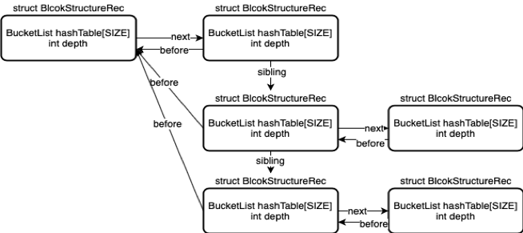
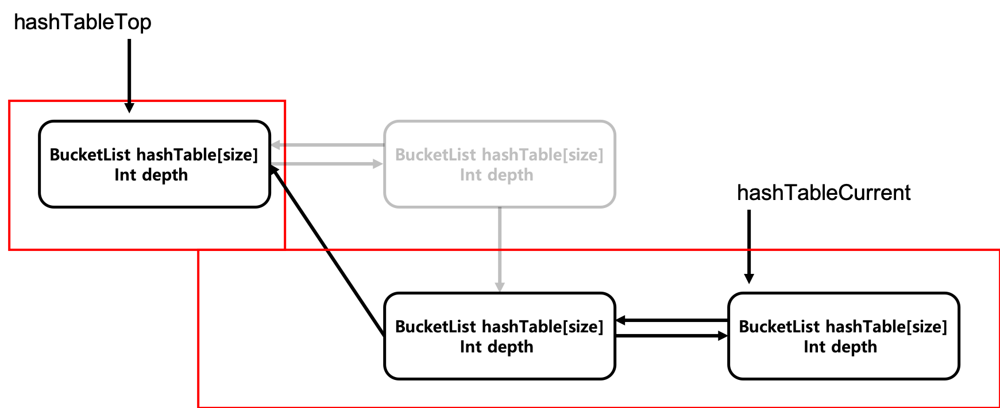

# Project #3
###### code reference: http://www.cs.sjsu.edu/~louden/cmptext
###### 20131612 최대운/ 20131547 김한길

### Obejct
- Build a Semantic Analyzer

### TODO
- Based on symtab.h and symtab.c, you need to implement a semantic analyzer, analyze.c.

### Implement

A block structure for constructing a symbol table for each scope.

Based on given structure BucketListRec, we create a two structure for maintain symbol's information.

- pass1: Scope check

Symbol's scope be checked from hashTableCurrent to hashTableTop.

- pass2: Type check

### Execute
- make
- ./20131612 [testfile]
